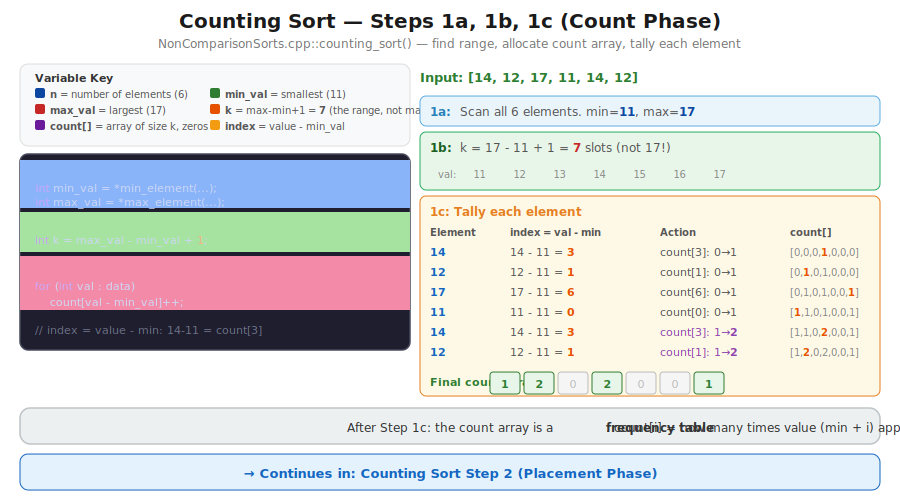
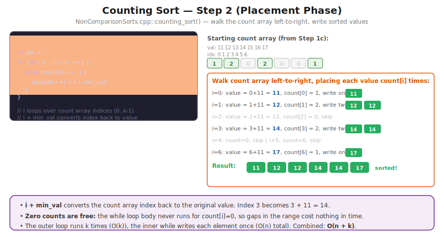
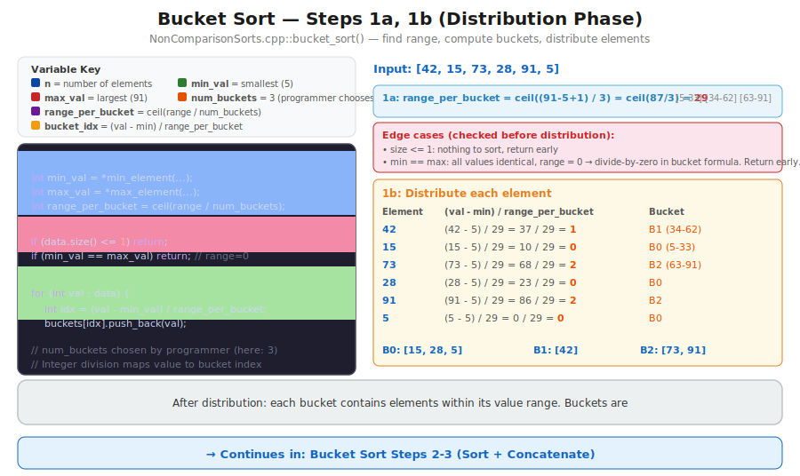
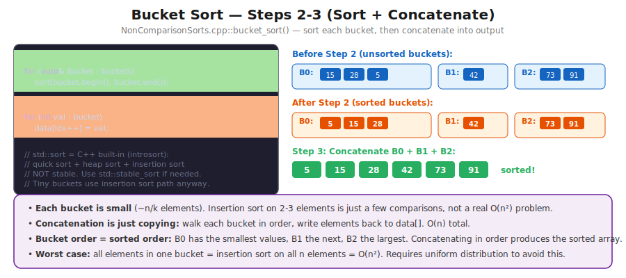
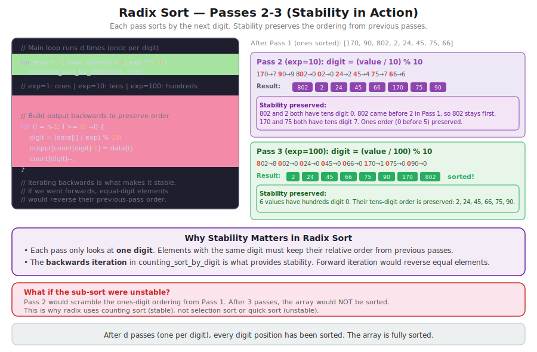

# CT14 -- Implementation Diagrams

Code-block diagrams referenced from `NonComparisonSorts.cpp`.

---

## 1. Counting Sort -- Steps 1a, 1b, 1c (Count Phase)
*`NonComparisonSorts.cpp::counting_sort()` -- find min/max, allocate count array, tally each element with full table*

---

## 2. Counting Sort -- Step 2 (Placement Phase)
*`NonComparisonSorts.cpp::counting_sort()` -- walk count array left-to-right, write sorted values to output*

---

## 3. Bucket Sort -- Steps 1a, 1b (Distribution Phase)
*`NonComparisonSorts.cpp::bucket_sort()` -- find range, compute range_per_bucket, distribute with formula walkthrough*

---

## 4. Bucket Sort -- Steps 2-3 (Sort + Concatenate)
*`NonComparisonSorts.cpp::bucket_sort()` -- sort each bucket, concatenate into sorted output*

---

## 5. Radix Sort -- Step 0 + Pass 1 Detail
*`NonComparisonSorts.cpp::radix_sort()` -- determine d and k, then first pass with digit extraction and counting sort*

---

## 6. Radix Sort -- Passes 2-3 (Stability in Action)
*`NonComparisonSorts.cpp::radix_sort()` -- tens and hundreds passes showing how stability preserves earlier ordering*

